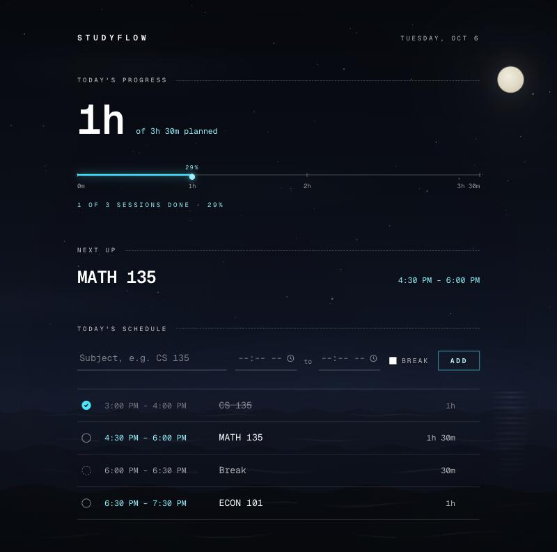
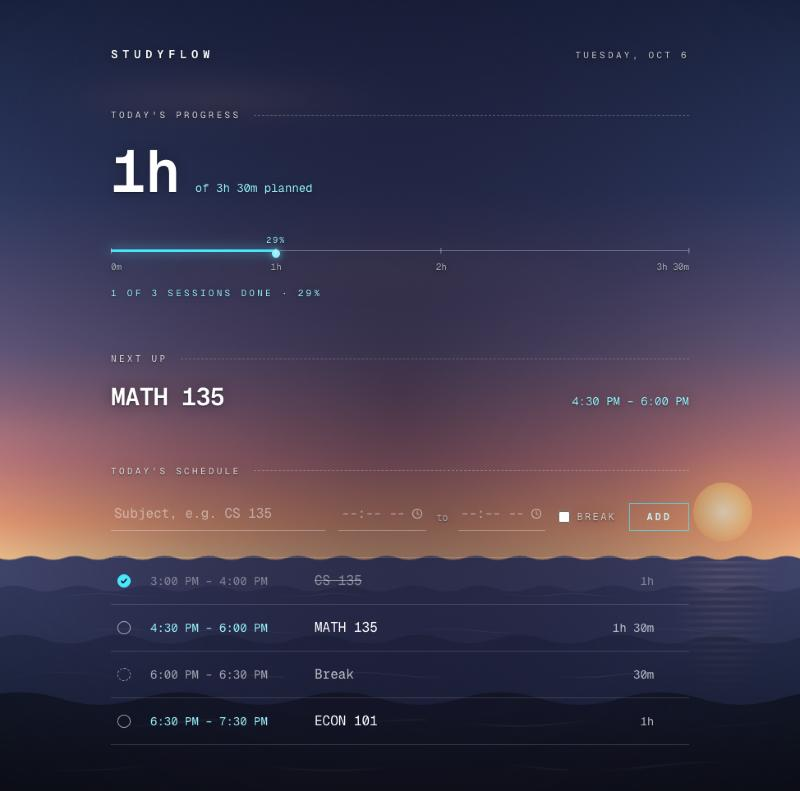
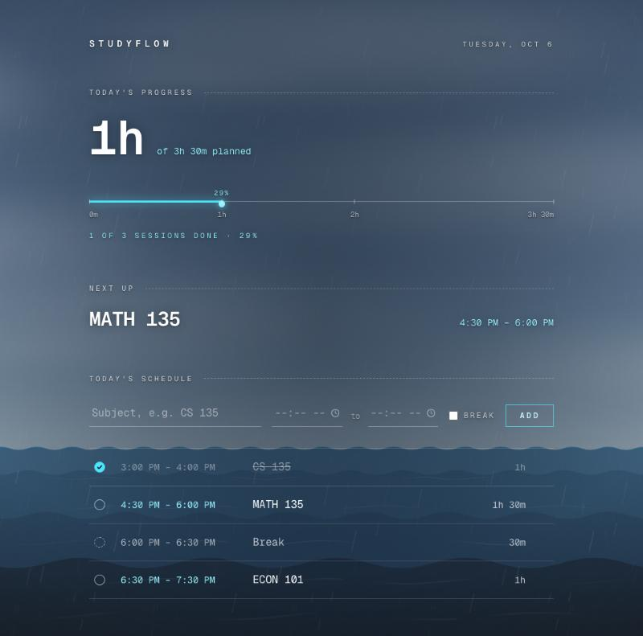
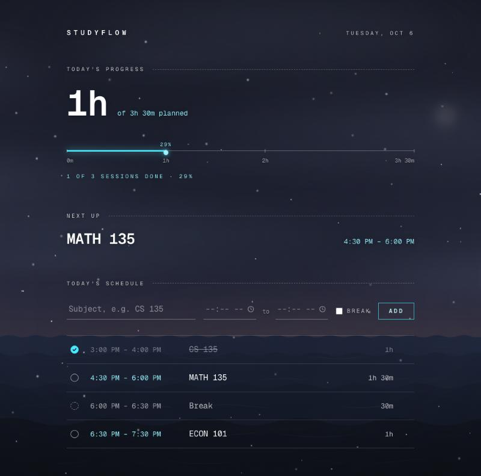

# StudyFlow

**Your study. Your schedule. Your flow.**

StudyFlow is a calm daily study planner. Lay out today's sessions and breaks, tick them off as you go, and watch your progress fill in — all floating over a quiet sky-and-water scene that follows the real weather and time of day where you are.

<p>
  
  
</p>
<p>
  
  
</p>

## Features

- **Plan your day** — add study sessions and breaks with a subject, start and end time. Sessions sort themselves by start time, and you can remove any of them.
- **Track progress** — click a session to mark it done (click again to undo). A progress line with hourly ticks shows study time completed out of time planned; breaks don't count.
- **Next up** — always shows the first study session you haven't finished.
- **Custom time picker** — hour, minute and AM/PM columns that match the rest of the UI, with keyboard support.
- **Saved automatically** — your schedule and checkmarks are kept in your browser (`localStorage`), so a refresh doesn't lose anything.
- **A living backdrop**
  - **Four times of day** — sunrise, day, dusk and night, based on your local sunrise and sunset.
  - **Six weathers** — clear, cloudy, rain, storm (with distant lightning), snow and fog, based on your current local weather.
  - **Animated water** — layered waves, ripples and a shimmering reflection of the sun or moon.
  - Everything cross-fades when it changes, and motion is reduced or turned off if your system asks for reduced motion.

## Getting started

Requires [Node.js](https://nodejs.org) 20.9 or newer.

```bash
git clone https://github.com/soccaskillz3-hub/studyflow.git
cd studyflow
npm install
npm run dev
```

Then open [http://localhost:3000](http://localhost:3000). Your browser will ask for your location so the scene can match your weather; if you decline, StudyFlow falls back to a clear sky and your device's clock.

Other scripts:

| Command         | What it does                         |
| --------------- | ------------------------------------ |
| `npm run build` | Production build                     |
| `npm start`     | Serve the production build           |
| `npm run lint`  | Run ESLint                           |

### Previewing scenes in development

While running `npm run dev`, a small **Scene · dev** panel appears in the bottom-right corner. Use it to force any weather or time of day (or set both back to **Auto**). Your choice survives reloads, which is handy while tweaking the scene's CSS. The panel is left out of production builds.

## How weather and time work

When you allow location access, StudyFlow asks [Open-Meteo](https://open-meteo.com) for the current weather code and today's sunrise and sunset, then refreshes every 30 minutes. Your coordinates are rounded to two decimal places (about 1 km) before being sent, and nothing else leaves your browser — there's no account, server or database.

- **Weather** comes from Open-Meteo's [WMO weather codes](https://open-meteo.com/en/docs#weather_variable_documentation), grouped into the six scenes.
- **Time of day**: sunrise runs from 45 minutes before to 75 minutes after sunrise; dusk from an hour before to 45 minutes after sunset; day and night fill the rest. Without location, sunrise and sunset are assumed to be 6:30 AM and 7:00 PM.

Open-Meteo's free API is for non-commercial use, which suits a personal project like this.

## Built with

- [Next.js 16](https://nextjs.org) (App Router) and [React 19](https://react.dev)
- [TypeScript](https://www.typescriptlang.org)
- [Tailwind CSS 4](https://tailwindcss.com)
- [Geist](https://vercel.com/font) Sans and Mono
- [Open-Meteo](https://open-meteo.com) for weather, sunrise and sunset

## Project structure

```
app/
├── page.tsx                  # Planner: progress, next up, schedule form and list
├── layout.tsx                # Fonts, metadata and the scene backdrop
├── globals.css               # Theme, scene palettes and animations
├── components/
│   ├── SceneBackdrop.tsx     # Location, weather and time logic + dev panel
│   ├── Backdrop.tsx          # The sky-and-water scene itself
│   └── TimePicker.tsx        # Custom hour / minute / AM-PM picker
└── lib/
    ├── weather.ts            # Open-Meteo request, weather codes, time of day
    └── time.ts               # "HH:MM" parsing and formatting helpers
```
