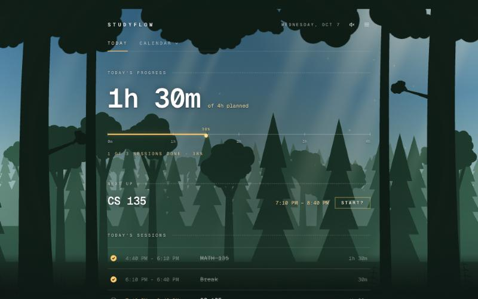
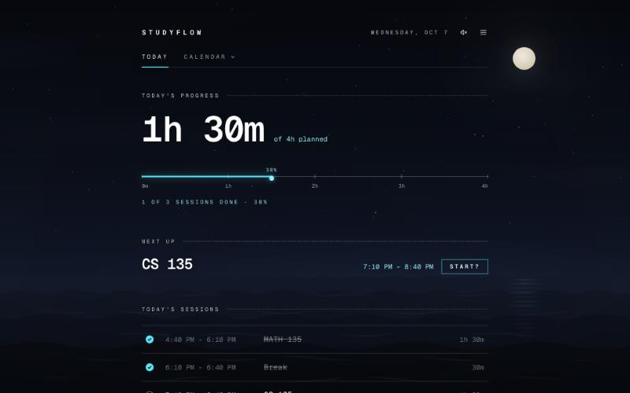
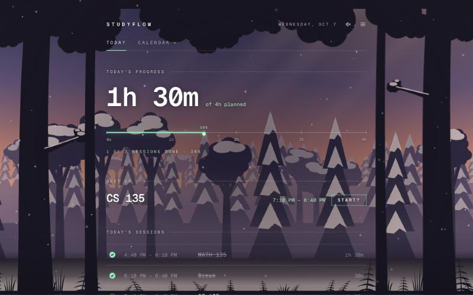
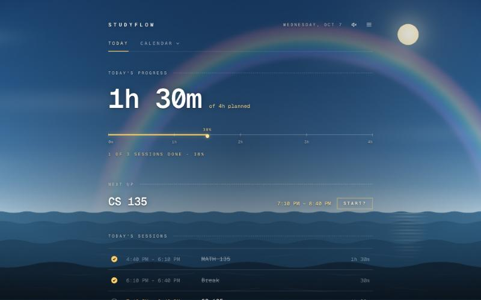
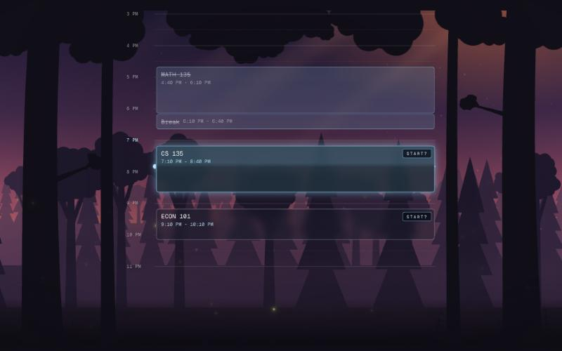
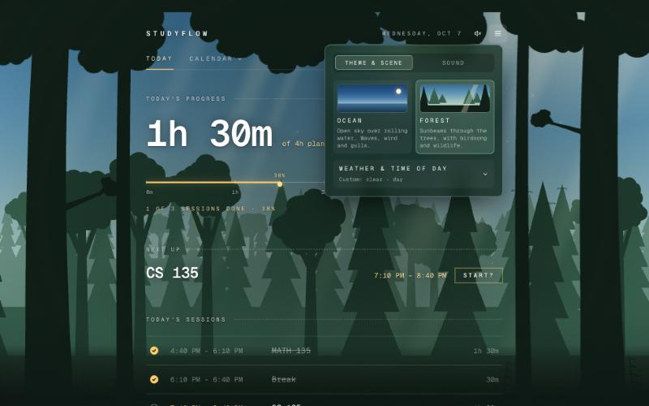
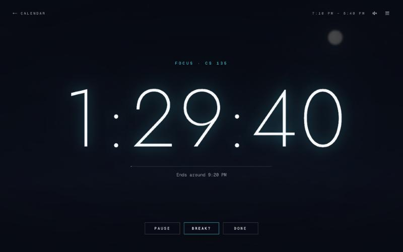
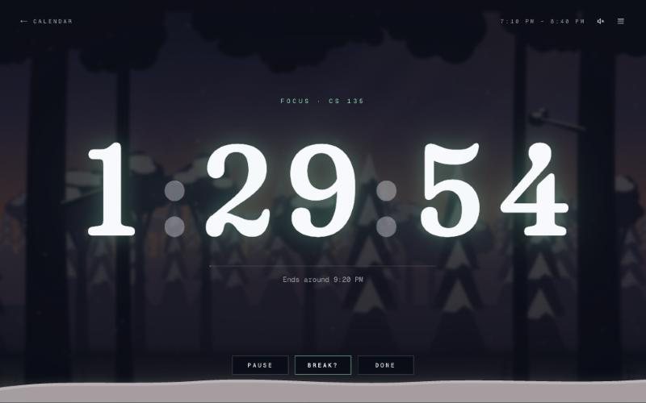

# StudyFlow

**Your study. Your schedule. Your flow.**

StudyFlow is a calm daily study planner. Lay out today's sessions, run a full-screen focus timer for each one, and watch your progress fill in — all floating over a living scene, an ocean or a forest, that follows the real weather and time of day where you are, with sound to match.

<p>
  
  
</p>
<p>
  
  
</p>

## Features

### Plan and focus

- **Dashboard** — the first thing you see when you log in. **This week** up top: study time done out of planned, your streak, and a bar for each day. Then **today**: your progress (breaks excluded), today's classes, what's on **now** or **next** (with the time left), and today's sessions. Click a session to tick it off.
- **Calendar** — a **week view** of everything at a glance (classes and study sessions, Monday to Sunday), and an hour-by-hour **day view** with a live "now" line. Step back and forward through weeks and days to plan ahead, with the arrows or by **swiping** (a finger on a phone or iPad, or two fingers on a trackpad); click any open time in the day view to add a session there (or the × on a session to remove it), and overlapping sessions sit side by side. **Schedule** lists today's sessions with an add form.
- **Classes** — paste your class schedule from your school's portal (Waterloo Quest's list view, other PeopleSoft systems, or plain lines like `CS 135 LEC MWF 10:30-11:20 MC 2065`). StudyFlow finds each course's lectures, tutorials and labs with their days, times, rooms and term dates, lets you untick anything it got wrong, and shows them on the calendar on the days they meet, in their own bold colour that changes with the scene. New accounts are asked whether they'd like to add their classes; it lives in **Settings → Classes** after that.
- **Progress** — your **streak** (days in a row with a study session done; the flame lights up once today counts), a GitHub-style grid of the **last six months** shaded by how much you got done, and a closer look at any **week** (swipe to move between weeks): done against planned for each day, and a breakdown **by course** ("CS 135 assignment" and "CS 135 lab prep" both count for CS 135).
- **Start? — timer or clock** — pressing **Start?** on a session asks whether you want the study timer or the clock. The first time you choose, it asks once whether to make that your default; either way it never asks again, and you can change it any time in **Settings → Focus**.
- **Focus timer** — a full-screen countdown of the session's length. Pause with the button or the space bar, take a break (10, 20, 30 minutes or your own length), add 10 more minutes when time's up, and press **Done** for a little celebration. The timer survives reloads and leaving the page, and the tab title shows the time left.
- **Clock** — a full-screen clock over the scene, for when you just want the time and the view (the clock button in the header, or from Start?). Swipe (a finger, or two fingers on a trackpad), drag, use the arrow keys or the dots to choose a style: **Classic** big numbers, an **Analog** dial with a sweeping second hand, the time in **Words** ("just after twenty-five past two"), **Orbit** rings for hours, minutes and seconds, or a **Sun path** showing where the sun or moon is in its arc. Your style is saved to your account. The controls fade away when you're not moving the mouse, it can go full screen, and it keeps the screen awake. Opened from a session, it shows that session with a **Done** button.
- **Custom time picker** — hour, minute and AM/PM columns with keyboard support.
- **Your own account** — sign up with an email and password. Each day's schedule, what you've finished, and your theme and sound settings are saved to your account, private to you, and follow you between devices. Visitors who aren't logged in see a welcome page.

<p>
  
  
</p>

### Themes

Pick a theme in **Settings → Theme**:

- **Ocean** — open sky over rolling, animated water.
- **Forest** — layered trees under an overhanging canopy, with light shafts falling through the gaps, drifting dust, fireflies after dark, and **wildlife that comes and goes**: birds, butterflies and a rabbit by day, deer at dawn and dusk, bats at dusk, and an owl and a fox at night.

Each theme has its own **timer font** for a completely different feel — a thin, airy sans by the ocean; a soft, chunky storybook serif in the forest — and the app's **accent colour** (progress bar, buttons, the timer) changes with the scene, picked to stand out against that sky. Classes get a second colour from the other side of the colour wheel (violet against the cyan night sea, coral against a gold day, ember against a blue forest dusk), filled more strongly in fog and snow so they stay easy to read.

<p>
  
  
</p>

### Weather and time of day

- **Four times of day** — sunrise, day, dusk and night, from your local sunrise and sunset.
- **Six weathers** — clear, cloudy, rain, storm (lightning, with thunder that follows it), snow and fog, from your current local weather.
- **Snow builds up** gradually: it settles on the ground and the trees over a couple of minutes, and piles up along the bottom of the timer while you focus.
- **A rainbow** appears for a while when rain or a storm clears.
- Choose **Auto** to follow your location, or pick any weather and time yourself.

### Sound

Every scene has its own soundscape, all synthesized in the browser (there are no audio files): waves, wind, rain and thunder; gulls, a buoy bell and a foghorn at sea; rustling leaves, birdsong, a woodpecker, crickets, frogs and owls in the forest. Animals you can see make their own sounds — the owl hoots, the deer's footsteps crunch through the leaves.

Turn sound on or off with the speaker button, and set **Master**, **Ambience**, **Wildlife** and **Timer chime** volumes in **Settings → Sound**. Browsers only allow audio after you interact with the page, so sound starts on your first click.

Everything cross-fades as it changes, and motion is reduced or turned off if your system asks for reduced motion.

## Getting started

Requires [Node.js](https://nodejs.org) 20.9 or newer.

```bash
git clone https://github.com/soccaskillz3-hub/studyflow.git
cd studyflow
npm install
```

StudyFlow stores accounts and schedules in [Supabase](https://supabase.com) (free plan is fine). One-time setup:

1. Create a Supabase project. In **Project Settings → API Keys**, copy the project URL and the **publishable** key into a `.env.local` file in the project folder (it's ignored by git):

   ```
   NEXT_PUBLIC_SUPABASE_URL=https://your-project.supabase.co
   NEXT_PUBLIC_SUPABASE_PUBLISHABLE_KEY=sb_publishable_...
   ```

2. In the **SQL Editor**, run each file in [`supabase/migrations`](supabase/migrations) in order. They create the tables and the row level security rules that keep each account's data private.
3. In **Authentication → URL Configuration**, set the Site URL to where the app runs (`http://localhost:3000` locally) and add `http://localhost:3000/**` to the Redirect URLs, plus your deployed address once you have one.
4. Optional, and only possible once you've set up custom SMTP in Supabase: so that email links work on any device, in **Authentication → Emails**, change the links in the **Confirm signup** and **Reset password** templates to:

   ```
   {{ .SiteURL }}/auth/confirm?token_hash={{ .TokenHash }}&type=email&next=/
   {{ .SiteURL }}/auth/confirm?token_hash={{ .TokenHash }}&type=recovery&next=/reset-password
   ```

   (With Supabase's default templates, links only work in the browser that asked for them.)

After at least two people have signed up, [`supabase/tests/privacy.sql`](supabase/tests/privacy.sql) checks in the SQL Editor that neither account can see or change the other's data.

```bash
npm run dev
```

Then open [http://localhost:3000](http://localhost:3000). Your browser will ask for your location so the scene can match your weather; if you decline, StudyFlow falls back to a clear sky and your device's clock.

| Command         | What it does               |
| --------------- | -------------------------- |
| `npm run dev`   | Start the dev server       |
| `npm run build` | Production build           |
| `npm start`     | Serve the production build |
| `npm run lint`  | Run ESLint                 |

In development, `window.__studyflowSound` in the browser console exposes the audio mixer for debugging. It's left out of production builds.

## How weather and time work

When you allow location access, StudyFlow asks [Open-Meteo](https://open-meteo.com) for the current weather code and today's sunrise and sunset, then refreshes every 30 minutes. Your coordinates are rounded to two decimal places (about 1 km) before being sent, and are never stored.

- **Weather** comes from Open-Meteo's [WMO weather codes](https://open-meteo.com/en/docs#weather_variable_documentation), grouped into the six scenes.
- **Time of day**: sunrise runs from 45 minutes before to 75 minutes after sunrise; dusk from an hour before to 45 minutes after sunset; day and night fill the rest. Without location, sunrise and sunset are assumed to be 6:30 AM and 7:00 PM.

Open-Meteo's free API is for non-commercial use, which suits a personal project like this.

## Built with

- [Next.js 16](https://nextjs.org) (App Router) and [React 19](https://react.dev)
- [TypeScript](https://www.typescriptlang.org) and [Tailwind CSS 4](https://tailwindcss.com)
- The Web Audio API for every sound
- [Geist](https://vercel.com/font), [Jost](https://fonts.google.com/specimen/Jost) and [Fraunces](https://fonts.google.com/specimen/Fraunces)
- [Supabase](https://supabase.com) for accounts and the Postgres database, with row level security
- [Open-Meteo](https://open-meteo.com) for weather, sunrise and sunset

## Project structure

```
proxy.ts                        # Keeps logins fresh; welcome page or login for visitors
supabase/
├── migrations/                 # Tables and privacy rules (run in the SQL Editor)
└── tests/privacy.sql           # Checks accounts can't reach each other's data
app/
├── (main)/                     # Pages that share the header (login required)
│   ├── page.tsx                # Dashboard: this week and streak, then today
│   ├── calendar/
│   │   ├── page.tsx            # Day view (any day: ?day=2026-10-14)
│   │   ├── week/page.tsx       # Week view
│   │   └── schedule/page.tsx   # Schedule: add form and today's list
│   ├── classes/page.tsx        # Paste a class schedule; your classes
│   └── progress/page.tsx       # Streak, six months of study days, a week by subject
├── (auth)/                     # Log in, sign up, forgot and reset password
├── auth/confirm/route.ts       # Where links in StudyFlow's emails land
├── welcome/page.tsx            # The front page for visitors who aren't logged in
├── focus/[id]/page.tsx         # Full-screen focus timer
├── clock/page.tsx              # Full-screen clock, five styles to swipe between
├── layout.tsx                  # Fonts, metadata and the app-wide providers
├── globals.css                 # Theme, scene palettes and animations
├── components/
│   ├── backdrop/               # The scene behind everything
│   │   ├── Backdrop.tsx        # Picks the theme, cross-fades, rainbows
│   │   ├── OceanScene.tsx      # Sky over water
│   │   ├── ForestScene.tsx     # Trees, light shafts, fireflies, snow
│   │   ├── ForestWildlife.tsx  # Animals and when they visit
│   │   ├── WeatherLayers.tsx   # Rain, lightning, snow and fog (shared)
│   │   └── forestShapes.ts     # Generated tree, canopy and fern shapes
│   ├── StudyHeatmap.tsx        # The six-month grid on Progress
│   ├── WeekBars.tsx            # A bar per day: done against planned
│   ├── clock/faces.tsx         # The clock styles
│   ├── StartButton.tsx         # Start?: the timer-or-clock choice
│   ├── SettingsMenu.tsx        # Theme, Sound, Focus, Classes, account
│   ├── MuteButton.tsx
│   ├── TimePicker.tsx
│   └── …                       # Header, session form and list
└── lib/
    ├── scene.tsx               # Theme, live weather and time of day
    ├── sound.tsx               # Sound settings, starts the soundscape
    ├── audio/
    │   ├── engine.ts           # The Web Audio graph, volumes, noise
    │   ├── soundscape.ts       # Ambient beds and calls for each scene
    │   └── sfx.ts              # One-off sounds: animals, thunder, chimes
    ├── schedule.tsx            # Today's sessions and what's done, saved to the account
    ├── settingsSync.tsx        # Saves theme, scene and sound settings to the account
    ├── prefs.tsx               # Small account choices: Start? default, clock style
    ├── history.ts              # Study totals by day, and streaks
    ├── classSchedule.ts        # Reads pasted class schedules
    ├── classes.tsx             # Imported classes and which days they meet
    ├── dayLayout.ts            # Sessions and classes laid out on a timeline
    ├── days.ts                 # "YYYY-MM-DD" day helpers in local time
    ├── account.tsx             # The logged-in user, for client components
    ├── auth.ts                 # Server actions: sign up, log in, log out, passwords
    ├── dal.ts                  # Server-side login check for pages
    ├── supabase/               # Supabase clients for the browser, server and proxy
    ├── useSwipe.ts             # Touch and trackpad swipes for next / previous
    ├── timer.ts                # The focus timer
    ├── weather.ts              # Open-Meteo request, weather codes, time of day
    └── time.ts                 # "HH:MM" helpers
```
